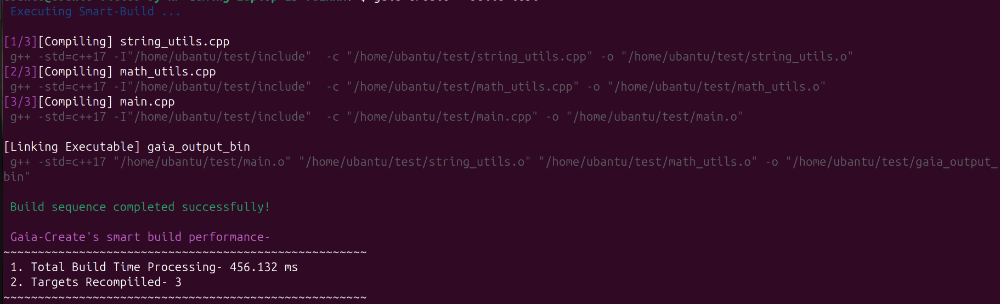

# Gaia-Create

A lightweight incremental build tool and offline code integrity guard written in C++17.

## Problem
Standard build tools can be complex for small projects, while manual compilation is inefficient and often recompiles unchanged files, wasting computing resources.

## Solution
Gaia-Create is a smart incremental build tool that tracks file modifications to recompile only modified source files. It includes a static analyzer using local LLMs to detect structural patterns in code and suggest changes.

## Features
- Incremental Build: Uses filesystem timestamps to skip unchanged files.
- Dependency Tracking: Identifies #include chains and circular dependencies.
- Offline AI Analysis: Integrates with local LLMs (Ollama) to analyze code structure privately.
- Location-Agnostic: Resolve project builds from any directory via absolute path mapping.
- Workspace Management: Cleanup of build artifacts.

## Architecture

### Project Folder
#### │
#### ▼
### Filesystem Scanner
#### │
#### ▼
Dependency Graph
#### │
#### ▼
Timestamp Checker
#### │
#### ▼
Incremental Builder
#### │
#### ├── Compile
#### └── Skip

## Algorithms - Complexity

 Dependency Graph Construction - O(V + E) 
 DFS Cycle Detection - O(V + E) 
 Incremental Scan - O(n) 
 Directory Traversal - O(files) 

## Comparison

| Feature | Make | CMake | Gaia-Create |
| :--- | :---: | :---: | :---: |
| Configuration | Complex | Complex | None |
| Incremental Build | Yes | Yes | Yes |
| Dependency Graph | Partial | Yes | Yes |
| Local AI Review | No | No | Yes |

## Installation

1. Install dependencies:
   sudo apt update && sudo apt install build-essential curl python3

2. Compile the tool:
   make

3. Install globally (creates a system-wide symbolic link):

   sudo rm -rf /usr/local/bin/gaia-create
   
   sudo ln -s "$(pwd)/gaia-create" /usr/local/bin/gaia-create

4. Setup for other projects:
   To use Gaia-Create for any project, simply reference the target directory in the build command. Gaia-Create automatically converts relative paths to absolute paths, ensuring consistent dependency resolution regardless of your current working directory.

5. Verify installation:
   gaia-create --help

## Usage

Build a project:

gaia-create --build /path/to/your/project

Run AI review:

gaia-create --review /path/to/your/project

## Performance Metrics

## Tech Stack
- Language: C++17
- Standard Library: STL, filesystem
- Build: Make
- AI Backend: Ollama

## Future Work
- Parallel compilation: Implementing multi-threaded execution for faster builds.
- JSON compilation database: Improving compatibility with IDEs.
- Windows support: Porting filesystem and socket logic.
- File hashing: Replacing timestamp checks with content hashing for higher accuracy.

## License
MIT License